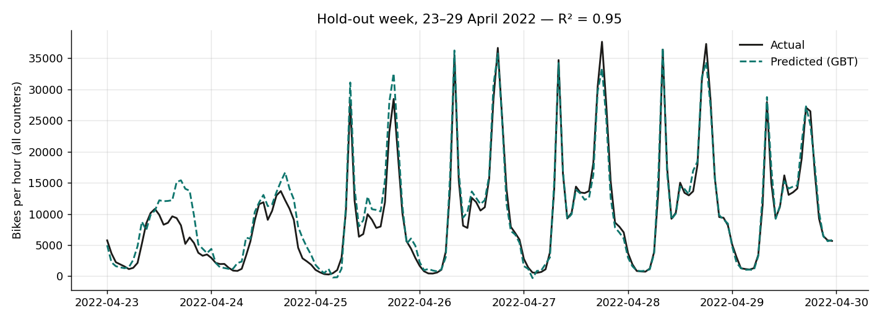
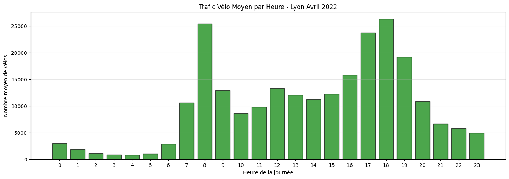
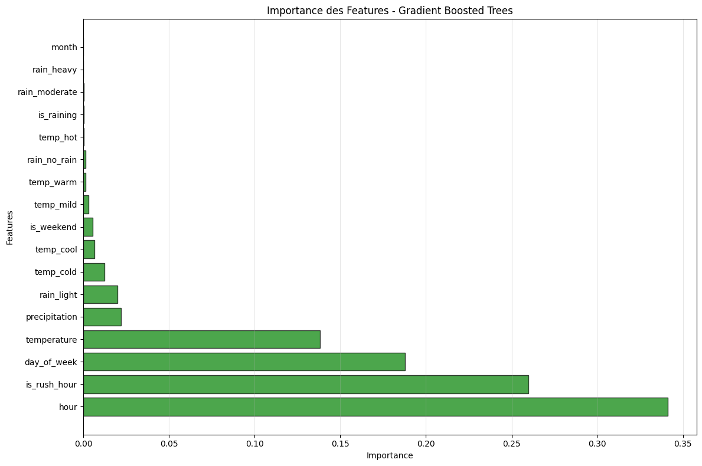

# MeteoVelo — Predicting Lyon's bike traffic from weather and time

**PySpark · Spark MLlib · Gradient Boosted Trees · Open data (Métropole de Lyon)**

How much does the weather really change the number of cyclists in Lyon? This project merges three public data
streams from the Métropole de Lyon (bike counters, temperature sensors, rain gauges), builds an hourly dataset with
Spark and trains regression models to predict city-wide bike traffic.

| | |
|---|---|
| **Data** | 262,872 hourly counts from 376 counting sites · 26,618 temperature readings (17 stations) · 5,866 rain readings (31 gauges) — April 2022 |
| **Best model** | Gradient Boosted Trees (Spark MLlib) |
| **Score (chronological hold-out week)** | **R² = 0.95**, MAE ≈ 1,350 bikes/h, **−33 % RMSE vs. seasonal-naive baseline** |
| **Context** | CPE Lyon Big Data project, team of 5 (Dec 2025 – Jan 2026). I built the whole ML pipeline (notebooks `01`–`06`) and the temporal validation. |



## Key findings

- **Time of day dominates.** Rush hours (8 am, 5–7 pm) carry 2–3× the mid-day traffic; `hour` + `is_rush_hour` account for 60–75 % of the feature importance.
- **Weather has a visible but secondary effect.** Between 7 am and 10 pm, rainy hours average ~33 % fewer cyclists than dry ones, and cold hours ~35 % fewer than mild ones. Once the hour and weekday are known, however, rain adds little predictive power (only 72 rainy daytime hours in the month), and the model relies on temperature instead.
- **The day of week is essential**: removing it drops R² from 0.95 to 0.76.
- Restricting the model to active hours (7 am–10 pm), which is what a "should I bike now?" app would need, still gives R² = 0.89.

<p float="left">
  
  
</p>

## Pipeline

```
Grand Lyon APIs ──► 00_retrieve_data ──► raw CSVs (counts, temperature, rain, sites)
                                             │
             01_exploration_donnees_spark ◄──┘   data quality: comma decimals, rain table only has rainy hours…
             02_fusion_donnees_spark            hourly aggregation + LEFT JOIN on bike hours, missing rain → 0 mm
             03_feature_engineering_spark       hour, weekday, rush hour, rain intensity, temperature buckets
             04_modelisation_spark              Linear Regression vs Decision Tree vs Random Forest vs GBT
             05_modelisation_heures_actives     same model restricted to 7 am–10 pm
             06_modelisation_sans_day_of_week   ablation study
             src/temporal_validation.py         chronological split + seasonal-naive baseline
```

## Results

**Model comparison (Spark MLlib, random 80/20 split):**

| Model | RMSE | MAE | R² |
|---|---:|---:|---:|
| **Gradient Boosted Trees** | **2,040** | **1,179** | **0.949** |
| Decision Tree | 2,356 | 1,597 | 0.931 |
| Random Forest | 3,044 | 1,984 | 0.885 |
| Linear Regression | 5,359 | 3,959 | 0.645 |

**Chronological validation.** A random split on hourly data lets the model see the same days it is tested on, so I
re-checked the approach with a strict time split — train on 1–22 April, test on the following week — and compared it
with a seasonal-naive baseline (same hour one week earlier):

| Model (test: 23–29 April) | RMSE | MAE | R² |
|---|---:|---:|---:|
| Seasonal naive (t − 7 days) | 2,977 | 1,615 | 0.887 |
| **Gradient Boosting** | **1,986** | **1,350** | **0.950** |

The performance holds on unseen future days, and the model beats the naive baseline by a third.

## Limitations & next steps

- **One month of data** (April 2022): seasonality, holidays and heavy-rain episodes are under-represented. Next step: extend to a full year via the same APIs.
- City-wide aggregate only; a per-counter model would support local infrastructure decisions.
- Add wind and forecast data (rather than observed weather) to make it usable as a real-time prediction service.

## Run it

```bash
pip install -r requirements.txt     # PySpark needs Java 11+
jupyter lab notebooks/
python src/temporal_validation.py   # scikit-learn only, ~2 s
```

Raw and processed datasets are included, so every notebook runs offline; `notebooks/00_retrieve_data.ipynb` shows how the
bike counts were pulled from the Grand Lyon API. The trained GBT model is saved in `models/gbt_24h`.

## Team

Big Data course project at CPE Lyon. Original team repository: [Arthur-Collignon/MeteoVelo](https://github.com/Arthur-Collignon/MeteoVelo).
Data collection and cleaning by Thomas Derville, Arthur Collignon and teammates; ML pipeline, analysis and validation by
Stanislas Sassolas.

## Resumen en español

Predicción del tráfico de bicicletas en Lyon a partir del clima y la hora, con PySpark sobre datos abiertos de la
Metrópolis de Lyon (376 contadores, 17 estaciones de temperatura, 31 pluviómetros). El mejor modelo (Gradient Boosted
Trees) alcanza **R² = 0,95** en una semana de prueba posterior al entrenamiento y reduce el error un 33 % frente a una
referencia ingenua. Hallazgo principal: la lluvia y el frío reducen el tráfico en torno a un tercio, pero la hora del día
y el día de la semana pesan mucho más en la predicción.
